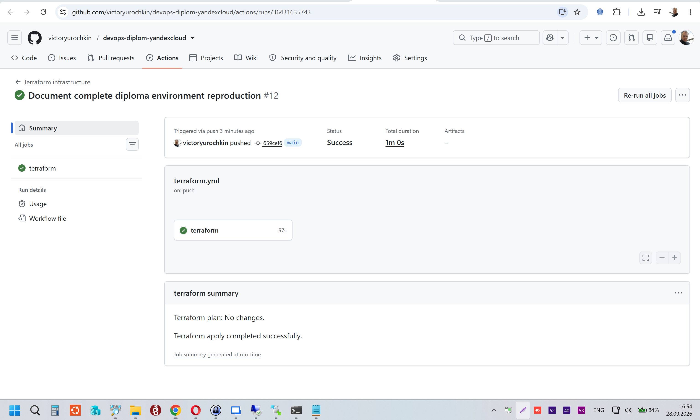
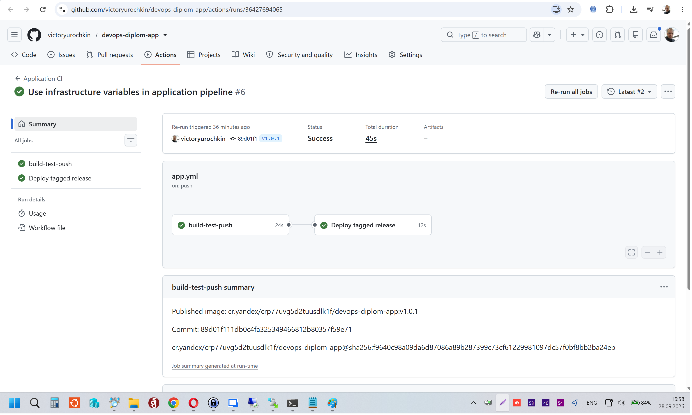
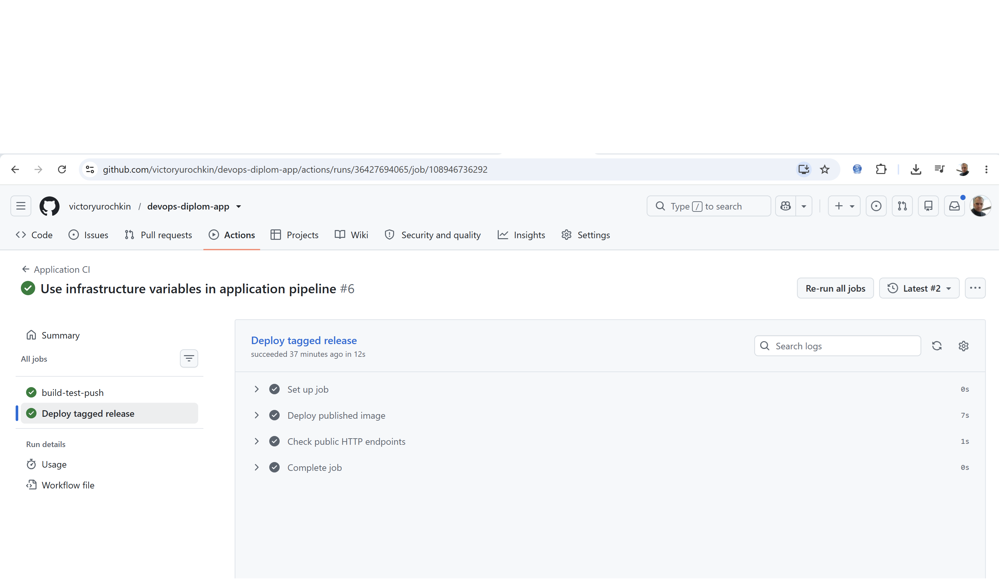
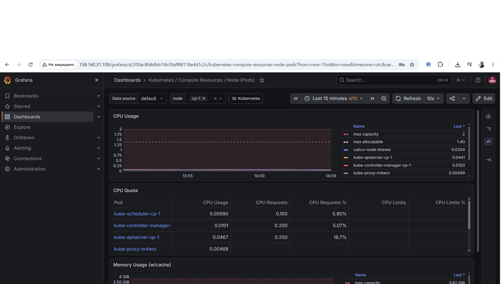
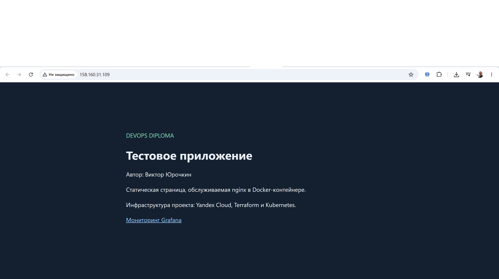

# Материалы для сдачи диплома DevOps

Автор: Виктор Юрочкин. Проверки выполнены 28 сентября 2026 года.

## Репозитории и конфигурации

| Требование | Реализация и ссылка |
|---|---|
| Облачная инфраструктура Terraform | [Основной репозиторий](https://github.com/victoryurochkin/devops-diplom-yandexcloud), [bootstrap](../terraform/bootstrap), [основная конфигурация](../terraform/infrastructure) |
| Kubernetes через Ansible | [Kubespray и параметры](../ansible), [генерация inventory](../scripts/generate-inventory.py), [запуск установки](../scripts/run-kubespray.sh) |
| Тестовое приложение и Dockerfile | [Репозиторий приложения](https://github.com/victoryurochkin/devops-diplom-app), [Dockerfile](https://github.com/victoryurochkin/devops-diplom-app/blob/main/Dockerfile), [тесты контейнера](https://github.com/victoryurochkin/devops-diplom-app/blob/main/scripts/test-image.sh) |
| Конфигурации Kubernetes | [Приложение](../kubernetes/app), [мониторинг](../kubernetes/monitoring), [Traefik](../kubernetes/traefik) |
| Terraform CI/CD | [Workflow](../.github/workflows/terraform.yml): каждый push в main запускает plan и apply |
| CI/CD приложения | [Workflow](https://github.com/victoryurochkin/devops-diplom-app/blob/main/.github/workflows/app.yml): сборка, тесты и push при коммите; дополнительный деплой при push тега |
| Воспроизведение стенда | [Полная инструкция](REPRODUCE.md) |

Выбран самостоятельный Kubernetes: один control plane и два прерываемых
worker-узла в трёх зонах доступности. Основной Terraform state хранится
в приватном S3-бакете с версионированием. Bootstrap расположен отдельно.

Мониторинг: Prometheus, Grafana, Alertmanager, node-exporter и kube-state-metrics
в составе kube-prometheus-stack. Traefik предоставляет HTTP-доступ на порту 80.
В качестве варианта инфраструктурного pipeline используется GitHub Actions.

## Доступ к приложению и мониторингу

| Сервис | Адрес |
|---|---|
| Приложение через worker-1 | http://158.160.31.109/ |
| Приложение через worker-2 | http://158.160.228.171/ |
| Grafana | http://158.160.31.109/grafana/ |
| Проверка приложения | http://158.160.31.109/healthz |
| Интерфейс CI/CD инфраструктуры | https://github.com/victoryurochkin/devops-diplom-yandexcloud/actions |
| Интерфейс CI/CD приложения | https://github.com/victoryurochkin/devops-diplom-app/actions |

Учётные данные Grafana передаются вместе с работой в закрытой форме сдачи.
Пароли и ключи в публичном репозитории отсутствуют.

## Образ приложения

Проверенный релиз: **v1.0.1**.

    cr.yandex/crp77uvg5d2tuusdlk1f/devops-diplom-app:v1.0.1

В Kubernetes используется образ по digest:

    cr.yandex/crp77uvg5d2tuusdlk1f/devops-diplom-app@sha256:f9640c98a09da6d87086a89b287399c73cf61229981097dc57f0bf8bb2ba24eb

Registry приватный. Ссылка выше идентифицирует образ; для скачивания требуется
авторизация. Приложение доступно по публичным HTTP-адресам без авторизации.

## Подтверждение CI/CD

- [Terraform CI после push 659cef6](https://github.com/victoryurochkin/devops-diplom-yandexcloud/actions/runs/36431635743): plan — No changes; apply — 0 added, 0 changed, 0 destroyed.
- [CI приложения при push в main](https://github.com/victoryurochkin/devops-diplom-app/actions/runs/36429850386): сборка, тесты и публикация успешны; deploy пропущен для ветки.
- [Релиз v1.0.1](https://github.com/victoryurochkin/devops-diplom-app/actions/runs/36427694065): успешная попытка 2, публикация образа и автоматический деплой с HTTP-проверками.

Первая попытка релиза остановилась на публикации с ответом Registry HTTP 503.
Повторный запуск завершился успешно. Тег при повторе не изменялся.

## Проверка пересоздания

28.09.2026 удалены и повторно созданы все 10 ресурсов основной
Terraform-конфигурации. При удалении Registry скрипт автоматически очистил
восемь образов. Bootstrap, сервисные аккаунты и S3 backend сохранены.
После создания повторный plan показал No changes.

Kubernetes установлен заново через Kubespray. Восстановлены данные локальных PV
мониторинга, Secret Grafana, приложение и доступ CD-runner к новому кластеру.
Затем CI/CD автоматически развернул v1.0.1.

Результаты проверок:

- [Мониторинг: 28/28 targets UP](monitoring-after-recreate-check.txt).
- [Исторические метрики старых и текущие метрики новых узлов](monitoring-history-check.txt).
- [Восстановление приложения из архива](app-after-recreate-check.txt).
- [Проверка текущего релиза приложения](app-release-after-recreate-check.txt).
- [Метаданные успешного CI/CD приложения](app-cicd-after-recreate-run.json).
- [Метаданные Terraform CI после пересоздания](terraform-cicd-after-recreate-run.json).

Исторические отчёты в docs могут содержать прежние IP и Registry ID.
Текущие адреса указаны в этой странице и README.

## Скриншоты

### Terraform pipeline

Автоматический запуск от push в main, успешный plan и apply.

### Сборка и публикация релиза

Релиз v1.0.1, успешные jobs и ссылка на опубликованный образ с digest.

### Деплой приложения

Успешны шаги Deploy published image и Check public HTTP endpoints.

### Grafana

Дашборд Kubernetes / Compute Resources / Node (Pods) для cp-1:
отображаются CPU-метрики компонентов за последние 15 минут.

### Страница приложения

Публичный HTTP-доступ через worker-1, отображаются страница и имя автора.

